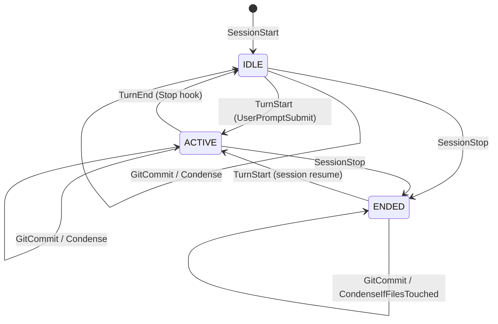
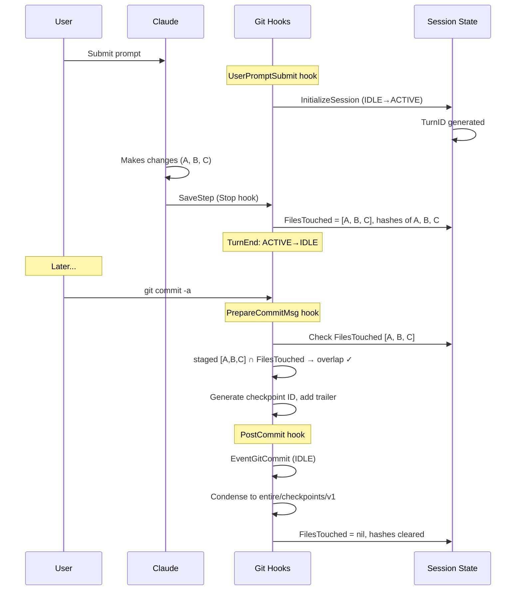
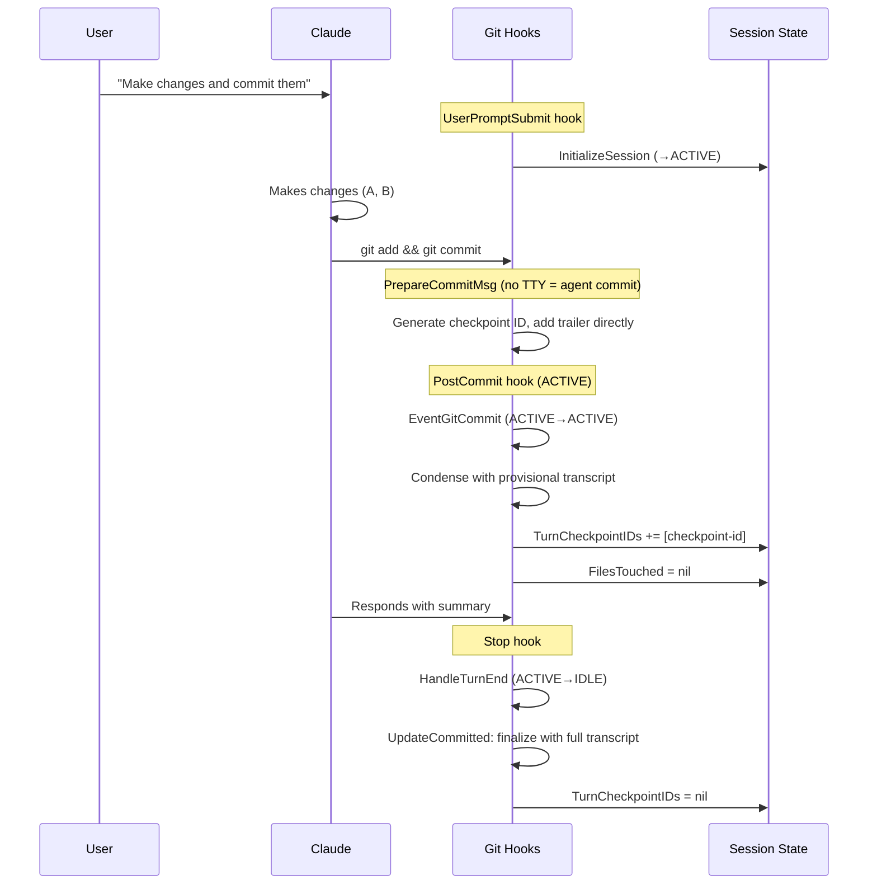
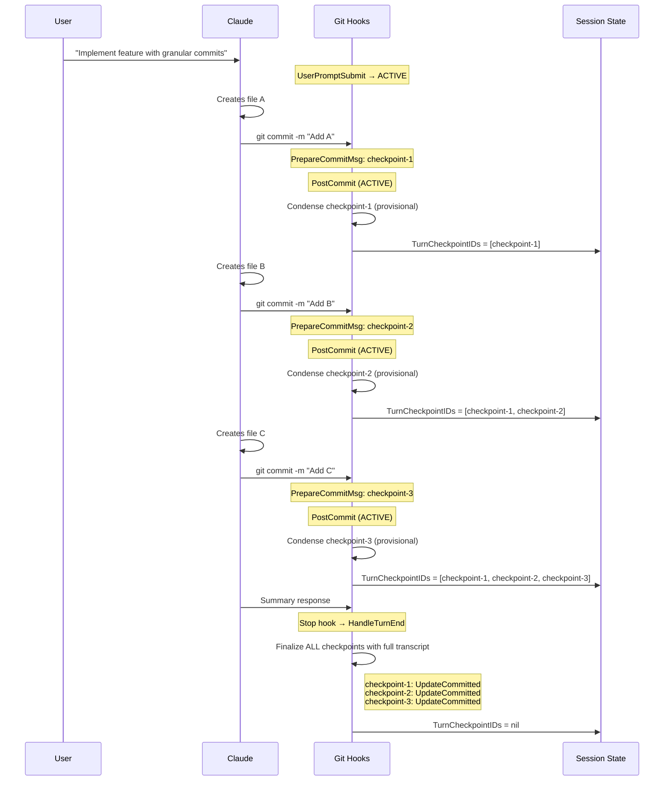
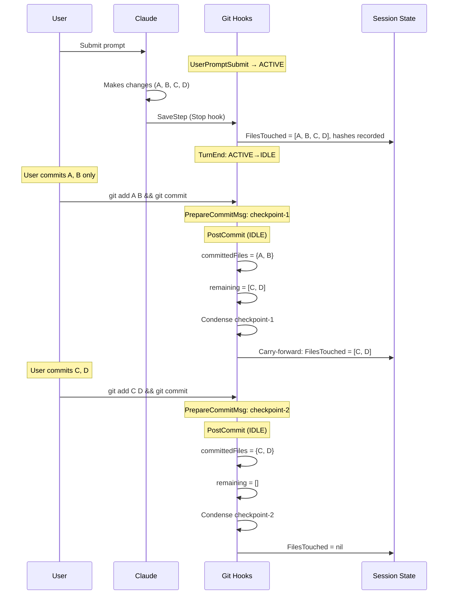
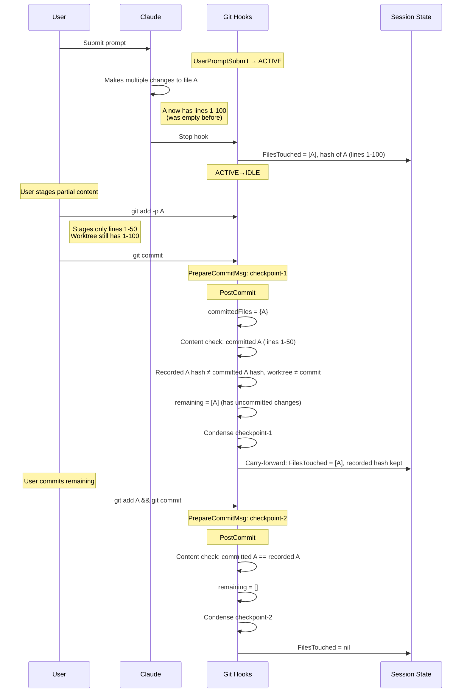
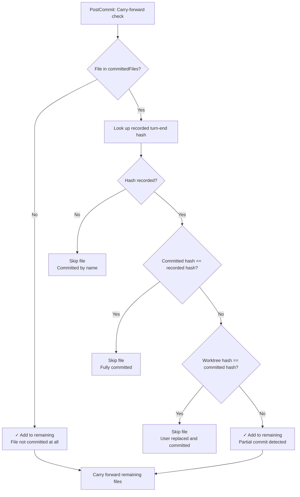
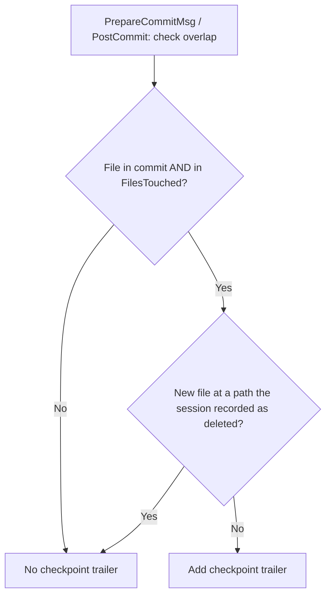
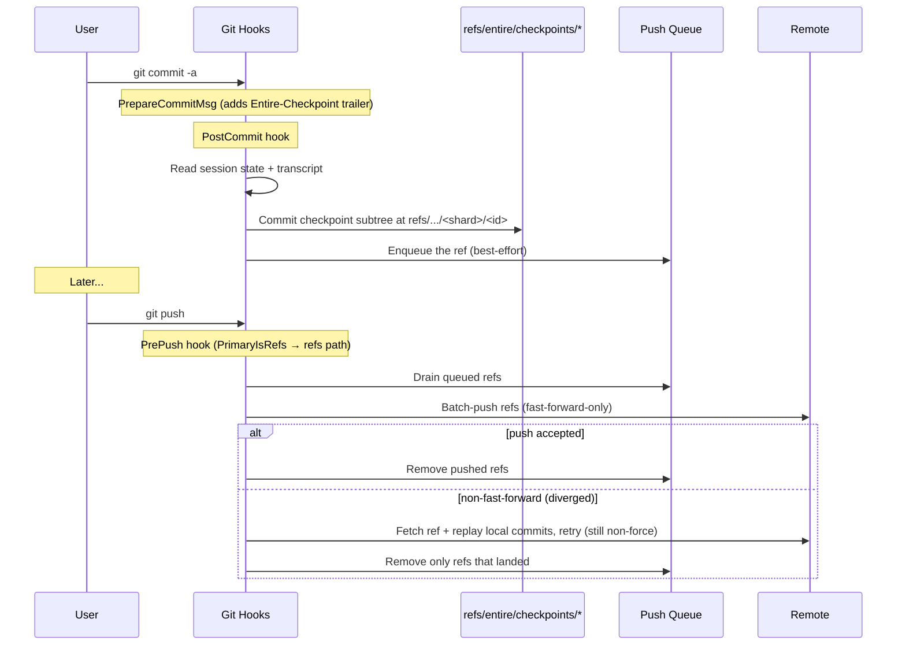

# Checkpoint Scenarios

This document describes how the one-to-one checkpoint system handles various user workflows.

## Overview

The system uses:
- **Session state** - each turn end records `FilesTouched` (files modified during the session, accumulated across prompts) and `TouchedFileHashes` (the git blob hash of each file as the agent left it); no git objects are written until a commit
- **1:1 checkpoints** - each commit gets its own unique checkpoint ID
- **Name-based linking, content-aware carry-forward** - a commit that carries any path the session touched links the session; recorded hashes only decide what work is left to carry forward

## State Machine


```mermaid
stateDiagram-v2
    [*] --> IDLE : SessionStart

    IDLE --> ACTIVE : TurnStart (UserPromptSubmit)
    ACTIVE --> IDLE : TurnEnd (Stop hook)
    ACTIVE --> ACTIVE : GitCommit / Condense
    IDLE --> IDLE : GitCommit / Condense

    IDLE --> ENDED : SessionStop
    ACTIVE --> ENDED : SessionStop
    ENDED --> ACTIVE : TurnStart (session resume)
    ENDED --> ENDED : GitCommit / CondenseIfFilesTouched
```

---

## Scenario 1: Prompt → Changes → Prompt Finishes → User Commits

The simplest workflow: user runs a prompt, Claude makes changes, prompt finishes, then user manually commits.


```mermaid
sequenceDiagram
    participant U as User
    participant C as Claude
    participant G as Git Hooks
    participant S as Session State

    U->>C: Submit prompt
    Note over G: UserPromptSubmit hook
    G->>S: InitializeSession (IDLE→ACTIVE)
    S->>S: TurnID generated

    C->>C: Makes changes (A, B, C)
    C->>G: SaveStep (Stop hook)
    G->>S: FilesTouched = [A, B, C], hashes of A, B, C
    Note over G: TurnEnd: ACTIVE→IDLE

    Note over U: Later...
    U->>G: git commit -a
    Note over G: PrepareCommitMsg hook
    G->>S: Check FilesTouched [A, B, C]
    G->>G: staged [A,B,C] ∩ FilesTouched → overlap ✓
    G->>G: Generate checkpoint ID, add trailer

    Note over G: PostCommit hook
    G->>G: EventGitCommit (IDLE)
    G->>G: Condense to entire/checkpoints/v1
    G->>S: FilesTouched = nil, hashes cleared
```

### Key Points
- Session state and the local transcript copy hold the pending work until the user commits; nothing is written to git at turn end
- PrepareCommitMsg adds `Entire-Checkpoint` trailer
- PostCommit condenses to permanent storage and cleans up

---

## Scenario 2: Prompt Commits Within Single Turn

Claude is instructed to commit changes, so the commit happens during the ACTIVE phase.


```mermaid
sequenceDiagram
    participant U as User
    participant C as Claude
    participant G as Git Hooks
    participant S as Session State

    U->>C: "Make changes and commit them"
    Note over G: UserPromptSubmit hook
    G->>S: InitializeSession (→ACTIVE)

    C->>C: Makes changes (A, B)
    C->>G: git add && git commit

    Note over G: PrepareCommitMsg (no TTY = agent commit)
    G->>G: Generate checkpoint ID, add trailer directly

    Note over G: PostCommit hook (ACTIVE)
    G->>G: EventGitCommit (ACTIVE→ACTIVE)
    G->>G: Condense with provisional transcript
    G->>S: TurnCheckpointIDs += [checkpoint-id]
    G->>S: FilesTouched = nil

    C->>G: Responds with summary
    Note over G: Stop hook
    G->>G: HandleTurnEnd (ACTIVE→IDLE)
    G->>G: UpdateCommitted: finalize with full transcript
    G->>S: TurnCheckpointIDs = nil
```

### Key Points
- Agent commits detected by no TTY → fast path adds trailer directly
- **Deferred finalization**: PostCommit saves provisional transcript, HandleTurnEnd updates with full transcript
- TurnCheckpointIDs tracks mid-turn checkpoints for finalization at stop

---

## Scenario 3: Claude Makes Multiple Granular Commits

Claude is instructed to make granular commits, resulting in multiple commits during one turn.


```mermaid
sequenceDiagram
    participant U as User
    participant C as Claude
    participant G as Git Hooks
    participant S as Session State

    U->>C: "Implement feature with granular commits"
    Note over G: UserPromptSubmit → ACTIVE

    C->>C: Creates file A
    C->>G: git commit -m "Add A"
    Note over G: PrepareCommitMsg: checkpoint-1
    Note over G: PostCommit (ACTIVE)
    G->>G: Condense checkpoint-1 (provisional)
    G->>S: TurnCheckpointIDs = [checkpoint-1]

    C->>C: Creates file B
    C->>G: git commit -m "Add B"
    Note over G: PrepareCommitMsg: checkpoint-2
    Note over G: PostCommit (ACTIVE)
    G->>G: Condense checkpoint-2 (provisional)
    G->>S: TurnCheckpointIDs = [checkpoint-1, checkpoint-2]

    C->>C: Creates file C
    C->>G: git commit -m "Add C"
    Note over G: PrepareCommitMsg: checkpoint-3
    Note over G: PostCommit (ACTIVE)
    G->>G: Condense checkpoint-3 (provisional)
    G->>S: TurnCheckpointIDs = [checkpoint-1, checkpoint-2, checkpoint-3]

    C->>G: Summary response
    Note over G: Stop hook → HandleTurnEnd
    G->>G: Finalize ALL checkpoints with full transcript
    Note right of G: checkpoint-1: UpdateCommitted<br/>checkpoint-2: UpdateCommitted<br/>checkpoint-3: UpdateCommitted
    G->>S: TurnCheckpointIDs = nil
```

### Key Points
- Each commit gets its own unique checkpoint ID (1:1 model)
- All checkpoints are finalized together at turn end
- Each checkpoint has the full session transcript for context

---

## Scenario 4: User Splits Changes Into Multiple Commits

User decides to create multiple commits from Claude's changes after the prompt finishes.


```mermaid
sequenceDiagram
    participant U as User
    participant C as Claude
    participant G as Git Hooks
    participant S as Session State

    U->>C: Submit prompt
    Note over G: UserPromptSubmit → ACTIVE

    C->>C: Makes changes (A, B, C, D)
    C->>G: SaveStep (Stop hook)
    G->>S: FilesTouched = [A, B, C, D], hashes recorded
    Note over G: TurnEnd: ACTIVE→IDLE

    Note over U: User commits A, B only
    U->>G: git add A B && git commit
    Note over G: PrepareCommitMsg: checkpoint-1
    Note over G: PostCommit (IDLE)
    G->>G: committedFiles = {A, B}
    G->>G: remaining = [C, D]
    G->>G: Condense checkpoint-1
    G->>S: Carry-forward: FilesTouched = [C, D]

    Note over U: User commits C, D
    U->>G: git add C D && git commit
    Note over G: PrepareCommitMsg: checkpoint-2
    Note over G: PostCommit (IDLE)
    G->>G: committedFiles = {C, D}
    G->>G: remaining = []
    G->>G: Condense checkpoint-2
    G->>S: FilesTouched = nil
```

### Key Points
- **Carry-forward logic**: uncommitted files stay in session state (`StepCount = 1`, transcript offsets reset) so the next commit links to the session
- Each commit gets its own checkpoint ID (1:1 model)
- Both checkpoints link to the same session transcript

### Content-Aware Carry-Forward

The carry-forward logic uses **content-aware comparison** to determine which files have remaining uncommitted changes:

1. **File not in commit** → has remaining changes
2. **File in commit, hash matches the recorded turn-end hash** → fully committed, no carry-forward
3. **File in commit, hash differs from the recorded one, but the clean-filtered working-tree hash matches the commit** → the user replaced the agent content and committed it fully, no carry-forward
4. **File in commit, hash differs from both the recorded hash and the clean-filtered working tree** → partial commit (e.g., `git add -p`), carry forward
5. **Recorded deletion** → carried forward while still pending (the commit tree has the path and the worktree lacks it), so the commit that finally deletes it links; dropped once a commit removes the path or the file is re-created
6. **No recorded hash** (a session from an older CLI, hashing failed, a symlink, or a path from a task record or per-tool hook) → if committed, kept while the working tree differs from the committed blob and dropped when it matches; if not committed, kept unless missing from the worktree

The recorded hashes and the working-tree hash are computed by native Git (`git hash-object`), so `core.autocrlf`, Git LFS, `ident`, and custom clean filters do not create phantom differences. Symlinks are never hashed at turn end because `git hash-object` follows the link rather than hashing its target-path string; they fall back to name matching.

This enables splitting changes within a single file across multiple commits (see Scenario 5).

---

## Scenario 5: Partial Staging with `git add -p`

User uses interactive staging to commit only some hunks of a file, leaving other agent changes uncommitted.


```mermaid
sequenceDiagram
    participant U as User
    participant C as Claude
    participant G as Git Hooks
    participant S as Session State

    U->>C: Submit prompt
    Note over G: UserPromptSubmit → ACTIVE

    C->>C: Makes multiple changes to file A
    Note right of C: A now has lines 1-100<br/>(was empty before)
    C->>G: Stop hook
    G->>S: FilesTouched = [A], hash of A (lines 1-100)
    Note over G: ACTIVE→IDLE

    Note over U: User stages partial content
    U->>G: git add -p A
    Note right of U: Stages only lines 1-50<br/>Worktree still has 1-100

    U->>G: git commit
    Note over G: PrepareCommitMsg: checkpoint-1

    Note over G: PostCommit
    G->>G: committedFiles = {A}
    G->>G: Content check: committed A (lines 1-50)
    G->>G: Recorded A hash ≠ committed A hash, worktree ≠ commit
    G->>G: remaining = [A] (has uncommitted changes)
    G->>G: Condense checkpoint-1
    G->>S: Carry-forward: FilesTouched = [A], recorded hash kept

    Note over U: User commits remaining
    U->>G: git add A && git commit
    Note over G: PrepareCommitMsg: checkpoint-2

    Note over G: PostCommit
    G->>G: Content check: committed A == recorded A
    G->>G: remaining = []
    G->>G: Condense checkpoint-2
    G->>S: FilesTouched = nil
```

### Key Points
- **Content-aware carry-forward**: Compares git blob hashes, not just filenames
- Partial staging (`git add -p`) within a single file is detected
- Each commit links to the session, even when splitting one file's changes

### How Content Comparison Works


```mermaid
flowchart TD
    A[PostCommit: Carry-forward check] --> B{File in committedFiles?}
    B -->|No| C[✓ Add to remaining<br/>File not committed at all]
    B -->|Yes| D[Look up recorded turn-end hash]
    D --> E{Hash recorded?}
    E -->|No| F[Skip file<br/>Committed by name]
    E -->|Yes| G{Committed hash == recorded hash?}
    G -->|Yes| H[Skip file<br/>Fully committed]
    G -->|No| K{Worktree hash == committed hash?}
    K -->|Yes| L[Skip file<br/>User replaced and committed]
    K -->|No| I[✓ Add to remaining<br/>Partial commit detected]

    C --> J[Carry forward remaining files]
    I --> J
```

---

## Linking a Commit to a Session

A commit links the session when it carries any path in `FilesTouched`, matched by name: modified, deleted, and new files alike, whatever their committed content. A user editing an agent-created file before committing it is far more common than a user overwriting it wholesale, so the committed blob is not compared with the recorded hash for linking. The one exception is a path the session recorded as deleted: if the commit adds it as a new file, someone else re-created it after the agent deleted it, and it does not link.


```mermaid
flowchart TD
    A[PrepareCommitMsg / PostCommit: check overlap] --> B{File in commit AND in FilesTouched?}
    B -->|No| Z[No checkpoint trailer]
    B -->|Yes| C{New file at a path the session recorded as deleted?}
    C -->|No| H[Add checkpoint trailer]
    C -->|Yes| Z
```

### Example: User Rewrites an Agent-Created File

```mermaid
sequenceDiagram
    participant U as User
    participant C as Claude
    participant G as Git Hooks

    C->>C: Creates file X with content "hello"
    Note over G: Turn end records X (hash: abc123)

    U->>U: Rewrites X
    Note right of U: X now has content "world"<br/>(hash: def456)

    U->>G: git add X && git commit
    Note over G: PrepareCommitMsg
    G->>G: X in FilesTouched? Yes
    Note over G: Entire-Checkpoint trailer added
    Note over G: PostCommit: carry-forward compares def456<br/>with abc123 and the worktree; both agree<br/>on def456, so nothing is left to carry
```

---

## Scenario 6: git-refs Backend — Condensation and Push

All scenarios above describe the default **git-branch** backend, which condenses to the single `entire/checkpoints/v1` branch. When the primary backend is **git-refs**, the session/timing/overlap logic is **identical** — the only differences are *where* condensation writes and *how* the result is pushed. Everything about when a checkpoint is created, what it contains, and content-aware carry-forward is unchanged.

Two differences:

1. **Condensation target.** Instead of splicing the checkpoint subtree under `<id[:2]>/<id[2:]>/` on the `v1` branch, git-refs commits that same subtree as the tree root of a per-checkpoint ref, `refs/entire/checkpoints/<shard>/<id>` (orphan commit on first write, parented on later backfills). The ref is then recorded in a **push-discovery queue** rather than advancing a shared branch tip.
2. **Push mechanism.** Pre-push drains the queue and pushes exactly the changed refs, fast-forward-only, instead of pushing one branch.


```mermaid
sequenceDiagram
    participant U as User
    participant G as Git Hooks
    participant R as refs/entire/checkpoints/*
    participant PQ as Push Queue
    participant Rem as Remote

    U->>G: git commit -a
    Note over G: PrepareCommitMsg (adds Entire-Checkpoint trailer)
    Note over G: PostCommit hook
    G->>G: Read session state + transcript
    G->>R: Commit checkpoint subtree at refs/.../<shard>/<id>
    G->>PQ: Enqueue the ref (best-effort)

    Note over U: Later...
    U->>G: git push
    Note over G: PrePush hook (PrimaryIsRefs → refs path)
    G->>PQ: Drain queued refs
    G->>Rem: Batch-push refs (fast-forward-only)
    alt push accepted
        G->>PQ: Remove pushed refs
    else non-fast-forward (diverged)
        G->>Rem: Fetch ref + replay local commits, retry (still non-force)
        G->>PQ: Remove only refs that landed
    end
```

### Key Points
- Condensation writes one commit per checkpoint under `refs/entire/checkpoints/<shard>/<id>`; there is no shared branch tip to serialize on.
- Enqueue is best-effort — a checkpoint that lands locally but fails to enqueue is still correct locally and re-enqueues on its next write.
- Pushes are never forced; a diverged ref is recovered by fetch + replay so the remote commit is preserved as an ancestor.
- Failed or interrupted pushes leave refs queued for the next pre-push — the queue degrades toward "will retry", never toward silent loss.
- Reads route by ID kind across both backends, so a repo mid-migration reads hex (branch) and ULID (refs) checkpoints transparently.

See [Ref-Based Checkpoint Backend](ref-checkpoint-backend.md) for the full backend design (sharding, read routing, configuration, and rollout).

---

## Summary Table

| Scenario | When Checkpoint Created | Checkpoint Contains | Key Mechanism |
|----------|------------------------|---------------------|---------------|
| 1. User commits after prompt | PostCommit (IDLE) | Full transcript | Normal condensation |
| 2. Claude commits in turn | PostCommit (ACTIVE) + HandleTurnEnd | Full transcript (finalized at stop) | Deferred finalization |
| 3. Multiple Claude commits | Each PostCommit (ACTIVE) + HandleTurnEnd | Full transcript per checkpoint | TurnCheckpointIDs tracking |
| 4. User splits commits | Each PostCommit (IDLE) | Full transcript per checkpoint | Content-aware carry-forward |
| 5. Partial staging with `git add -p` | Each PostCommit (IDLE) | Full transcript per checkpoint | Content-aware carry-forward (hash comparison) |
| 6. git-refs backend | Same timing as 1–5 (backend-orthogonal) | Same as 1–5 | Condense to `refs/entire/checkpoints/<shard>/<id>` + push-queue drain at pre-push |

---

## Known Caveats

### 1. Redundant Transcript Data Across Commits

Each checkpoint stores the **full session transcript** up to that point. If a session results in multiple commits (Scenarios 3, 4, 5), each checkpoint contains overlapping transcript data.

**Example**: Session with 3 commits
- Checkpoint 1: transcript lines 1-100
- Checkpoint 2: transcript lines 1-200 (includes 1-100 again)
- Checkpoint 3: transcript lines 1-300 (includes 1-200 again)

**Trade-off**: This simplifies checkpoint retrieval (each is self-contained) at the cost of storage efficiency.

### 2. Token Usage Sums Are Misleading

Each checkpoint's `metadata.json` contains cumulative token usage for the entire session up to that point. Summing token counts across multiple checkpoints from the same session **double-counts tokens**.

**Example**:
- Checkpoint 1: 10,000 tokens (session total so far)
- Checkpoint 2: 25,000 tokens (session total so far)
- Naive sum: 35,000 tokens ❌
- Actual usage: 25,000 tokens ✓

**Correct approach**: Use the token count from the **last checkpoint** of a session, or track incremental deltas separately.

### 3. No Per-File Prompt Attribution

Checkpoints don't explicitly tag which prompt created which file. To determine this, you must parse the transcript and correlate `tool_use` entries with preceding `user` messages. The `files_touched` list in metadata is cumulative across all prompts.

### 4. Carry-Forward Checkpoints Include Full Transcript

When files are carried forward (Scenario 4), `CheckpointTranscriptStart` is reset to 0. This means each carry-forward checkpoint includes the **entire transcript**, not just new content since the last checkpoint.

**Impact**: For long sessions with many partial commits, checkpoint storage grows linearly with session length × number of commits.

### 5. Crash Before HandleTurnEnd Leaves Provisional Transcripts

In Scenarios 2 and 3 (Claude commits during turn), checkpoints are saved with "provisional" transcripts during PostCommit. The full transcript is written at HandleTurnEnd (Stop hook).

If the session crashes or is killed before the Stop hook fires:
- Checkpoints exist with partial transcripts
- `TurnCheckpointIDs` in session state tracks which need finalization
- Next session start does **not** automatically finalize orphaned checkpoints

### 6. Two Different Checks

The system uses two separate checks with different purposes; only the second compares content:

**A. Overlap Detection** (`filesOverlapWithContent`, `stagedFilesOverlapWithContent`) - Determines if commit should be linked to session:
- Matches by **name** for modified, deleted, and new files alike; no content comparison
- Exception: a new file at a path the session recorded as deleted does not link
- Used in PrepareCommitMsg/PostCommit for non-ACTIVE sessions
- **Purpose**: Link every commit that carries the session's work, including after the user edited it

**B. Carry-Forward Detection** (`filesWithRemainingAgentChanges`) - Determines which files to carry forward:
- Applies to **all committed files**
- Compares committed content hash vs the recorded turn-end hash
- Hash mismatch with the worktree still differing = partial commit, file carried forward
- **Purpose**: Enable splitting changes within a file across commits (Scenario 5)

### 7. Carry-Forward Content Superseded by New Prompts

When files are carried forward and then a new prompt modifies the same file:
- The new prompt's turn end records a **new** hash for the file
- The carried-forward hash is overwritten
- Subsequent commits compare against the **new prompt's content**, not the original carried-forward content

**Example**:
1. Prompt 1: Agent writes 100 lines to file A
2. User commits 50 lines via `git add -p`
3. Carry-forward: A stays in `FilesTouched` with its 100-line hash
4. Prompt 2: Agent adds 50 more lines to A (now 150 lines total in worktree)
5. Turn end: the recorded hash for A is now the 150-line version
6. User commits: Comparison is against 150 lines, not original 100 lines

This is correct behavior - the recorded hash reflects the **current combined state** of the session's work.

### 8. Automatic Cleanup During Normal Operations

Most orphaned data is cleaned up automatically:

- **Session states**: An ended session with no pending work (`State.HasPendingWork`) and no `LastCheckpointID` is removed during session listing
- **Legacy shadow branches**: Branches older CLI versions wrote (`entire/<hex>-<hex>`) are deleted once at the first session start after upgrading

For anything that slips through, run `entire clean --all` manually:

```bash
entire clean --all          # Preview orphaned items, including legacy shadow branches
entire clean --all --force  # Delete orphaned items
```
