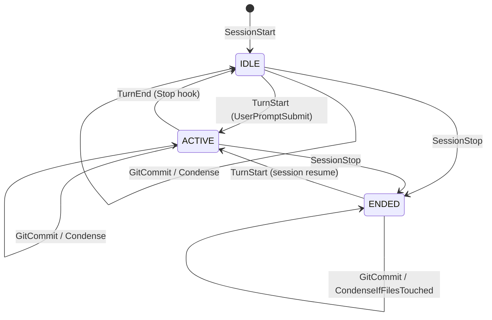
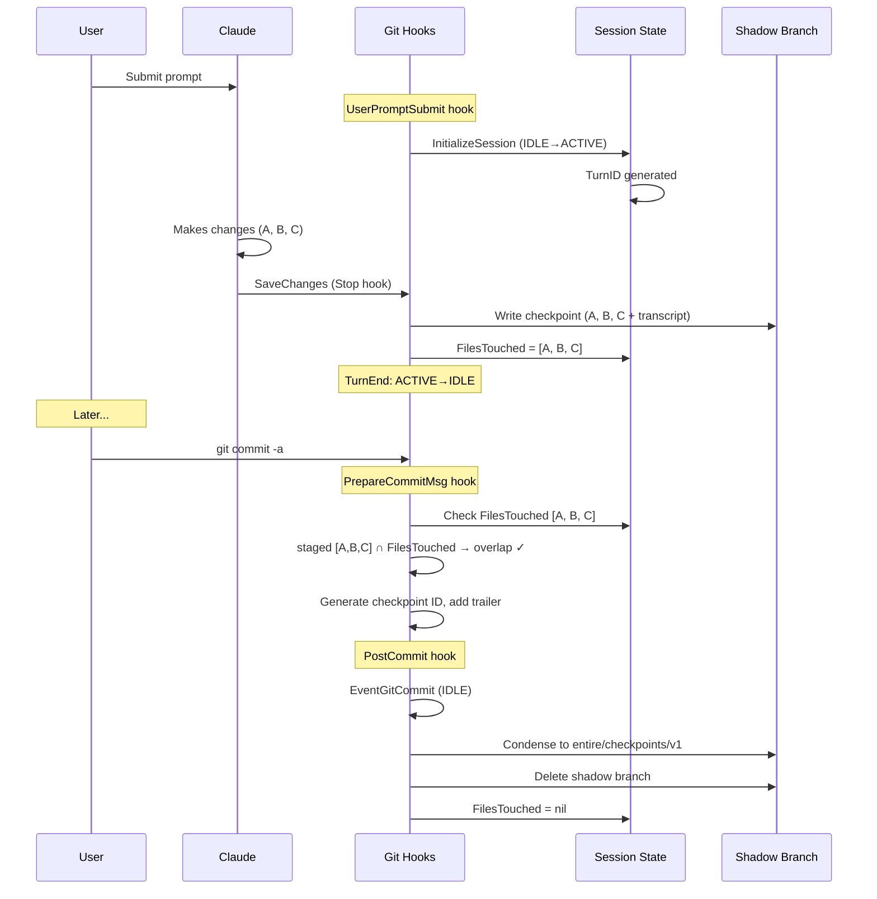
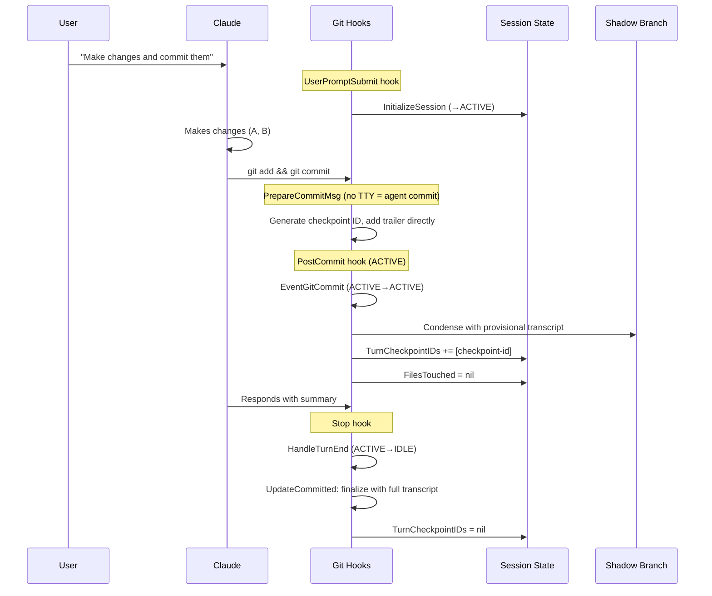
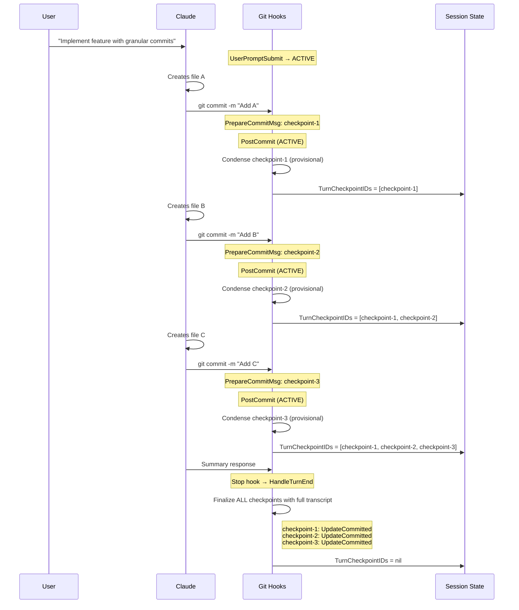
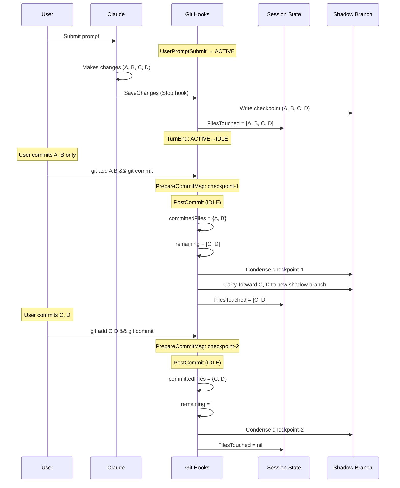
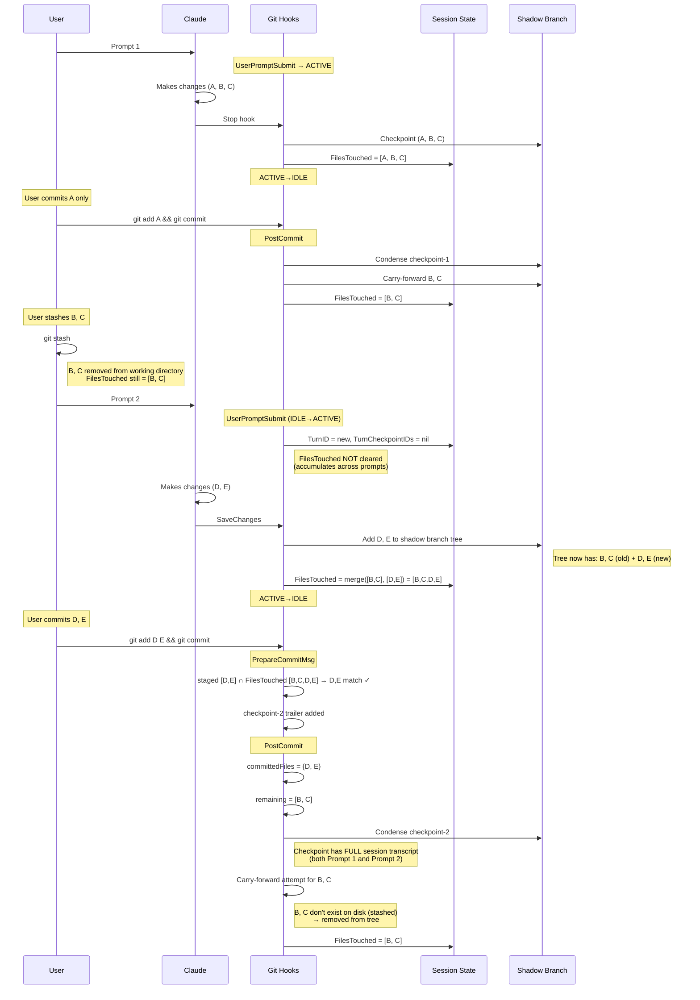
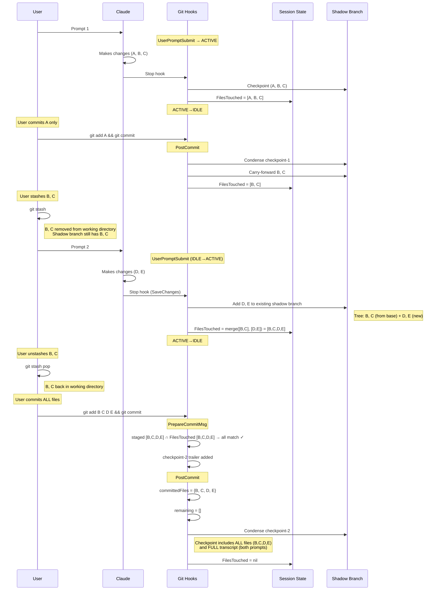
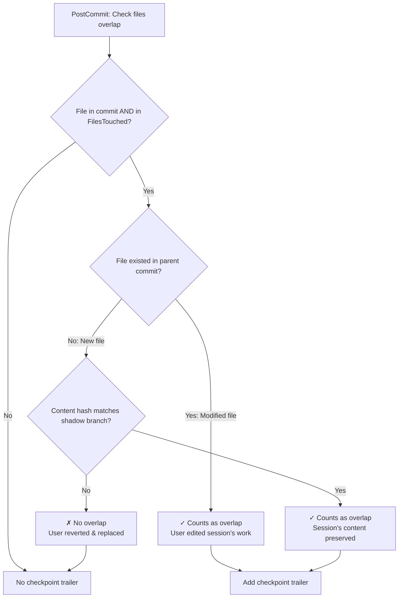
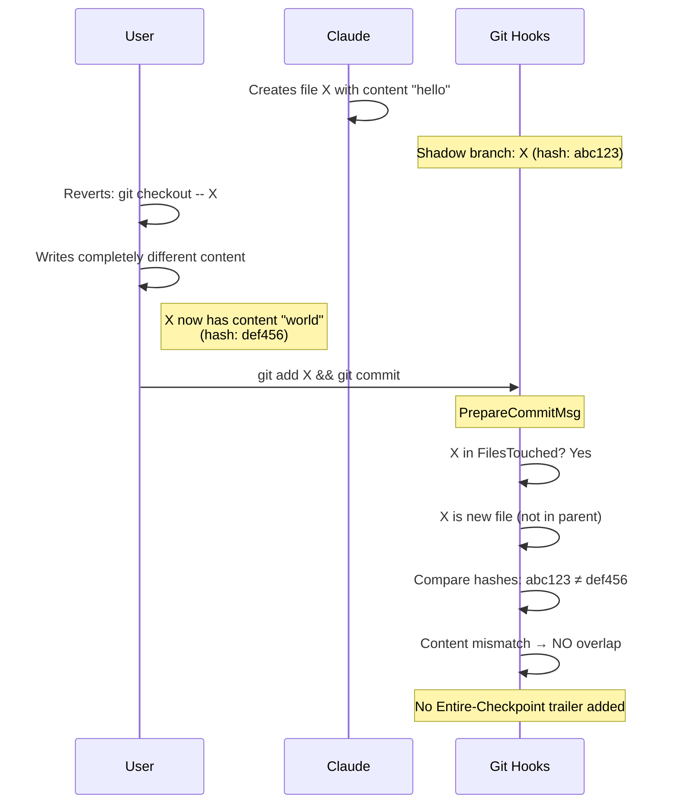

# Checkpoint Scenarios

This document describes how the one-to-one checkpoint system handles various user workflows.

## Overview

The system uses:
- **Shadow branches** (`entire/<commit-hash>-<worktree-hash>`) - temporary storage for checkpoint data
- **FilesTouched** - accumulates files modified during the session
- **1:1 checkpoints** - each commit gets its own unique checkpoint ID
- **Content-aware overlap** - prevents linking commits where user reverted session changes

## State Machine

---

## Scenario 1: Prompt → Changes → Prompt Finishes → User Commits

The simplest workflow: user runs a prompt, Claude makes changes, prompt finishes, then user manually commits.

### Key Points
- Shadow branch holds checkpoint data until user commits
- PrepareCommitMsg adds `Entire-Checkpoint` trailer
- PostCommit condenses to permanent storage and cleans up

---

## Scenario 2: Prompt Commits Within Single Turn

Claude is instructed to commit changes, so the commit happens during the ACTIVE phase.

### Key Points
- Agent commits detected by no TTY → fast path adds trailer directly
- **Deferred finalization**: PostCommit saves provisional transcript, HandleTurnEnd updates with full transcript
- TurnCheckpointIDs tracks mid-turn checkpoints for finalization at stop

---

## Scenario 3: Claude Makes Multiple Granular Commits

Claude is instructed to make granular commits, resulting in multiple commits during one turn.

### Key Points
- Each commit gets its own unique checkpoint ID (1:1 model)
- All checkpoints are finalized together at turn end
- Each checkpoint has the full session transcript for context

---

## Scenario 4: User Splits Changes Into Multiple Commits

User decides to create multiple commits from Claude's changes after the prompt finishes.

### Key Points
- **Carry-forward logic**: uncommitted files get a new shadow branch
- Each commit gets its own checkpoint ID (1:1 model)
- Both checkpoints link to the same session transcript

---

## Scenario 5: Partial Commit → Stash → Next Prompt

User commits some changes, stashes the rest, then runs another prompt.

### Key Points
- **FilesTouched accumulates** across prompts (not cleared at TurnStart)
- **Checkpoints have full session context**: D, E commit links to transcript showing BOTH prompts
- **No wrong attribution**: Looking at checkpoint-2, you can see D, E were created by Prompt 2

### Edge Case: Stashed Files Lose Shadow Content

After user commits D, E, the carry-forward for B, C creates an "empty" checkpoint:
- `buildTreeWithChanges` removes non-existent files (B, C are stashed) from the tree
- A shadow branch commit is created, but its tree is just HEAD (no B, C content)
- `FilesTouched` is set to `[B, C]` - the files are still **tracked by name**

**If user later unstashes B, C and commits them:**
- PrepareCommitMsg: staged [B, C] overlaps with FilesTouched [B, C] by filename → trailer added ✓
- PostCommit: checkpoint is created and linked
- But the shadow branch doesn't have the original B, C content from Prompt 1

This is acceptable behavior - stashing files mid-session and committing other files first is an explicit user action. The files are still tracked, but the shadow branch content chain is broken.

---

## Scenario 6: Stash → Second Prompt → Unstash → Commit All

User stashes files, runs another prompt, then unstashes and commits everything together.

### Key Points
- **Shadow branch accumulates**: D, E added on top of existing B, C from carry-forward
- **All files tracked**: When user commits all together, all four files link to checkpoint
- **Full session context**: Checkpoint transcript shows Prompt 1 created B, C and Prompt 2 created D, E

### Contrast with Scenario 5

| Scenario | User Action | Result |
|----------|-------------|--------|
| **5**: Commit D, E first, then B, C later | Commits D, E while B, C stashed | B, C "fall out" - carry-forward fails, later commit of B, C has no shadow content |
| **6**: Commit all together after unstash | Unstashes B, C, commits B, C, D, E together | All files linked to single checkpoint |

The key difference is **when the commit happens relative to the unstash**:
- If you commit while files are stashed → those files lose their shadow branch content
- If you unstash first, then commit → all files are preserved together

---

## Content-Aware Overlap Detection

Prevents linking commits where user reverted session changes and wrote different content.

### Example: Reverted and Replaced

---

## Summary Table

| Scenario | When Checkpoint Created | Checkpoint Contains | Key Mechanism |
|----------|------------------------|---------------------|---------------|
| 1. User commits after prompt | PostCommit (IDLE) | Full transcript | Normal condensation |
| 2. Claude commits in turn | PostCommit (ACTIVE) + HandleTurnEnd | Full transcript (finalized at stop) | Deferred finalization |
| 3. Multiple Claude commits | Each PostCommit (ACTIVE) + HandleTurnEnd | Full transcript per checkpoint | TurnCheckpointIDs tracking |
| 4. User splits commits | Each PostCommit (IDLE) | Full transcript per checkpoint | Carry-forward |
| 5. Partial commit + stash + new prompt + commit new | PostCommit (IDLE) | Full transcript (both prompts) | FilesTouched accumulation, stashed files "fall out" |
| 6. Stash + new prompt + unstash + commit all | PostCommit (IDLE) | All files + full transcript | Shadow branch accumulation |
