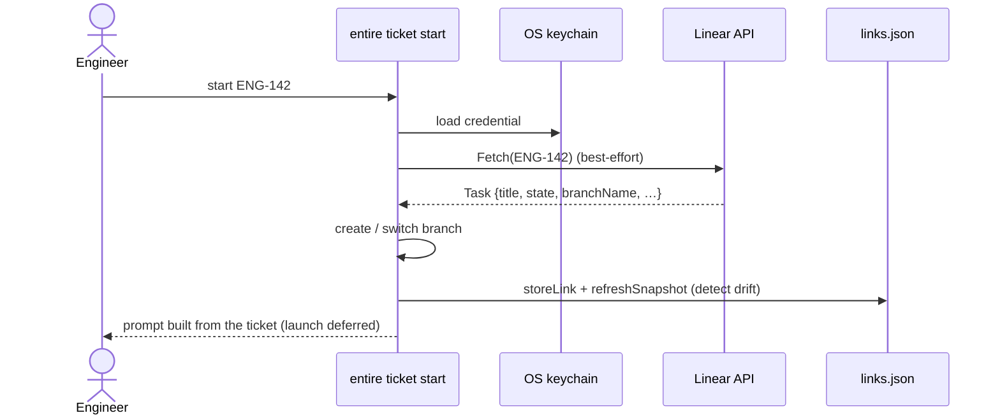

# `entire ticket` — Tech Spec

## Summary

`entire ticket` links work in a repository to tickets on an external tracker
(Linear today) and carries the ticket's content into the agent's context. The
link lives per branch, the ticket is fetched live, and a snapshot is kept so we
can flag when the ticket changes mid-work.

---

## Problem & motivation

**Immediate:** an agent working a task is only as good as the intent it's given.
That intent lives in the tracker (Linear/Jira/…), not in the codebase. Today
it's copy-pasted by hand, or lost. We want to **capture ticket context** and put
it where agents, reviews, and provenance can use it.

**Long-term unlock:** if the ticket is a first-class, captured input, the loop
from **ticket → production** can be increasingly automated and trustworthy:

- **Straight-through delivery** — a ticket becomes a branch, a change, a
  reviewed PR, and a status update, with a human gate for trust.
- **Improving models over time** — captured `(raw requirement → change →
  outcome)` triples are exactly the data that makes future agents better.

---

## The commands

```bash
# One-time, per repo: choose a tracker + team and store its API key securely.
entire ticket setup   [--platform linear --team ENG --token <key>]

# Link a ticket to the current branch. Auto-detects the id from the branch name
# when omitted. Works before, during, or after the work — the pointer is durable.
entire ticket link    [<id>] [--force]

# Remove the link from the current branch.
entire ticket unlink

# Link + create/switch a branch + prepare the agent prompt from the ticket.
# Creates a branch by default (Linear's suggested name, or <user>/<id>-<title>).
entire ticket start   [<id>] [--branch <name> | --no-branch] [--force] [--agent <name>]

# Show config, whether a credential is present, the linked ticket (live), + drift.
entire ticket status  [--json]

# Remove the stored credential (rotation / cleanup). Local only.
entire ticket revoke-token
```

**Flags at a glance:**

- `--force` — overwrite an existing link when the branch is already linked to a
  *different* ticket (otherwise the command refuses, to avoid clobbering).
- `--branch <name>` / `--no-branch` — name the new branch non-interactively, or
  stay on the current branch. Default is create-and-prompt.
- `--agent <name>` — which agent `start` will launch (default `claude-code`). A
  no-op while launch is disabled; kept for when launch returns.
- `--platform` / `--team` / `--token` — non-interactive `setup`.
- `--json` — machine-readable `status`.

---

## Goals & non-goals

**Goals**

- Configure a tracker per repo and store its credential securely.
- Link a ticket to a branch — anytime (before, during, after work).
- Fetch the ticket live and render it as agent context.
- Keep a working snapshot current and surface mid-work changes (drift).
- Be tracker-agnostic behind one interface.
- **Launch a coding agent on the ticket** — an intended feature, temporarily
  disabled during testing because a full agent per `start` is expensive.

**Non-goals (now)**

- Being a tracker (creating/managing tickets in Entire).
- Real-time push sync (webhooks / Linear Agent Sessions).
- Automatic write-back to the tracker.
- Team-shared link state across machines.

---

## Technical requirements

- **Latency** — one Linear round-trip on `start` / `status` (~100–500 ms).
  Best-effort: failure never blocks the command. `http.Client` timeout 30s;
  keyring reads guarded by a timeout (`tokenstore/keyring_timeout.go`).
- **Availability** — degrades gracefully: no network/credential → `start` falls
  back to an id-only prompt; `status` shows stored state. No hard dependency on
  a backend (local-first).
- **Consistency** — the local link/snapshot store is read-your-writes (atomic
  temp+rename). Ticket content is *eventually consistent* with Linear: re-fetched
  on demand (update-always), with drift surfaced on the next sync. No background
  reconciliation.

---

## APIs

### Internal — `Provider`

```go
Name() string
Fetch(ctx, id) (Task, error)            // read the ticket
Comment(ctx, id, body) error            // post a comment on the ticket (write-back)
SetState(ctx, id, state State) error    // move the ticket (e.g. → In Review) (write-back)
ResolveFromBranch(branch) (id, ok)      // infer the ticket id from a branch name
```

### External — Linear GraphQL

`https://api.linear.app/graphql`, `Authorization: <personal key>`:

- `issues(filter:{team.key, number})` — fetch by `TEAM-123`.
- `workflowStates(filter:{team.key})` — resolve target state for `SetState`.
- `commentCreate` / `issueUpdate` — write-back (not yet invoked).
- reads `issue.branchName` for the default branch.

---

## Data models

| Model | Stored in | Shape |
|---|---|---|
| `settings.TicketConfig` | `.entire/settings.json` | `{Platform, Team}` |
| `ticket.Task` | in-memory (fetched) | `{ID, Title, Intent, Acceptance, State, URL, BranchName, Labels, Comments}` |
| `ticket.Link` | `.git/entire-tickets/links.json` | `{Platform, ID, Snapshot}` |
| `ticket.Snapshot` | (nested in `Link`) | `{Title, State, URL, Digest, FetchedAt}` |
| `ticket.State` | — | normalized enum: todo / in_progress / in_review / done / unknown |
| `ticket.statusReport` | `--json` output | machine-readable status |
| `checkpoint.TicketRef` | `entire/checkpoints/v1` (per-session `metadata.json` `ticket`) | `{Platform, ID, Title, State, URL, Digest, FetchedAt}` — durable provenance |

---

## HLD

`entire ticket` is a thin, provider-agnostic command layer over three local
stores and one remote:

- **`settings.json`** — platform + team (per repo).
- **OS keychain** — the API credential.
- **`links.json`** (git common dir) — branch → link + snapshot.
- **Linear API** — the live ticket, reached only through the `Provider`
  interface, so the surface never depends on a specific tracker.

The commands compose those pieces: `setup` writes config + credential;
`link` / `start` associate a ticket with a branch (`start` also creates the
branch and prepares the prompt); `status` reads config + the live ticket;
`revoke-token` clears the credential. Only the provider behind `setup` is
platform-specific.

`start` is the path that exercises everything, and every remote step is
best-effort — a fetch failure degrades to an id-only prompt rather than blocking:



---

## Design principle: reuse, don't reinvent

New surface is limited to what's genuinely ticket-specific — the `Provider`
interface and the Linear client. **Everything else reuses existing Entire
conventions**, so this feature stays in-pattern with the rest of the CLI:

- the hidden noun-group + deps bridge (as `review` / `investigate`),
- the `settings` package (with `investigate`'s clobber-safe persistence),
- `tokenstore` for credentials,
- `uiform` for accessible prompts,
- `gitexec` / `paths` for git,
- the git-common-dir state layout,
- the `SilentError` / `cmd.OutOrStdout()` conventions.

### Package layout

Package `cmd/entire/cli/ticket/` (hidden noun group, `investigate`-style deps
bridge to avoid an import cycle with per-agent packages):

| File | Responsibility |
|---|---|
| `cmd.go` | group + `Deps{LaunchFix}` (bridge: `ticket_bridge.go`) |
| `provider.go` / `task.go` | `Provider` interface + `Task` / `State` / `Comment` |
| `platform.go` | `Platform` enum + `SupportedPlatforms` + parse |
| `creds.go` | `SaveToken` / `LoadToken` / `DeleteToken` via `tokenstore` |
| `setup.go` | interactive (`uiform`/huh) + flag paths; clobber-safe settings write |
| `link.go` | `link` / `unlink`, `linkCurrentBranch`, `storeLink`, `currentBranch` |
| `linkstore.go` | per-branch JSON store (atomic temp+rename) in the git common dir |
| `branch.go` | default branch name (Linear `branchName` or `<user>/<id>-<title>` slug), `createOrSwitchBranch` |
| `start.go` | orchestration; ticket-only prompt |
| `snapshot.go` | `Snapshot`, `taskDigest` (sha256), `diffSnapshot`, `refreshSnapshot` |
| `status.go` | `statusReport` (+ `--json`) |
| `linear.go` | `Provider` impl; injectable `httpDoer` |

### Key files

`cmd/entire/cli/ticket/*` · `cmd/entire/cli/ticket_bridge.go` ·
`settings.TicketConfig` · `internal/entireclient/tokenstore`.

---

## Read surfaces (observe-only)

Once a ticket is captured, it is surfaced across the CLI's read paths so the
intent the work was grounded in travels with the work. **This is deliberately
observe-only** — nothing here mutates the tracker (see [Write-back](#roadmap),
which is intentionally the next step, not part of this slice).

Two shapes feed the surfaces, resolved through shared helpers in
`cmd/entire/cli/ticket_display.go` (`formatTicketLinkLine` /
`formatTicketRefLine` / `ticketBriefFromLink`), so every surface renders the
same and none re-implements formatting:

| Surface | Source | Shows |
| --- | --- | --- |
| `checkpoint explain` | frozen `Metadata.Ticket` (per-checkpoint) | a `ticket` header row + URL; `--json` gains a `ticket` object per session |
| `entire status` | live `LinkForBranch` (current branch) | a `Ticket ·` line under the branch; `--json` gains a top-level `ticket` |
| `entire session info` | live `LinkForBranch` (session's recorded branch) | a `Ticket:` row + `--json` field; `session current` inherits it |
| `entire review` | live `LinkForBranch` (current branch) | prepends a "Linked ticket (original intent…)" block to the reviewer's context |

Design rules shared by all four:

- **Frozen vs. live is intentional.** `explain` reads the *captured* snapshot
  (durable provenance of what the ticket looked like at condense time); the
  live-branch surfaces read the *current* link so they reflect present state.
- **Best-effort, never blocking.** A missing link or lookup error omits the
  line; no surface fails or slows because of ticket state. Reads are local
  (link store), so there is no network round-trip on these paths.
- **`session list` is deliberately excluded** — a branch-scoped ticket would
  repeat per row; it stays a compact one-card-per-session view.

---

## Testing

- **Unit (hermetic, mostly parallel):** parsing, slugify, state mapping, prompt
  composition, snapshot diff; `Fetch` via an injectable `httpDoer`; credential
  round-trip via `tokenstore.UseFileBackendForTesting` (never the real keychain).
- **Real keychain:** in-process `go test` deliberately cannot reach it (test
  safety), so it is verified by running the **binary** without the file backend;
  `revoke-token` gives a clean teardown:

  ```bash
  entire ticket setup --platform linear --team ENG --token <key>   # → keychain
  entire ticket status                                             # Credential: present
  entire ticket revoke-token                                       # remove it
  ```

> **TODO — not yet covered:** e2e against a live tracker; write-back paths.

---

## Failure cases

| Case | Behavior |
|---|---|
| No platform configured | error → "run `entire ticket setup`" |
| Missing/invalid credential | fetch fails → best-effort fallback (id-only prompt / stored status) |
| Ticket not found | `Fetch` errors; `start`/`status` degrade |
| Detached HEAD | `currentBranch` errors clearly |
| Branch already exists | `start` switches to it |
| Network down / Linear outage | best-effort; command still completes |
| Keychain unavailable (headless Linux) | `setup`/load fails → use `ENTIRE_TOKEN_STORE=file` |
| Linear schema/permission change | fetch errors surface the API message |

---

## Security

- **Credential** in the OS keychain (macOS / Windows / Linux Secret Service) via
  `tokenstore`; **never** in settings, logs, or git. The `file` backend is
  plaintext — test/headless only.
- Personal API keys are powerful (they act as the user); `revoke-token` removes
  the local copy — rotate in Linear on exposure.
- **Untrusted content — bounded risk.** A ticket body is technically
  attacker-influenceable external input, but the blast radius is small here: the
  user supplies their *own* API key for their *own* tracker, and agent launch is
  off, so no untrusted text reaches an agent today. When launch ships, ticket
  content should still be treated as untrusted and run under the same guardrails
  as issue-seeded `investigate` runs.
- **Branch names** derived from ticket/user input are passed to `git switch`;
  the slug path sanitizes, but provider-supplied names should be validated.

---

## Observability

**Logging (done).** `logging.Debug` is emitted on ticket link, fetch (success +
duration and failure), drift detection, and branch create/switch — operational
metadata only (platform, ticket id, branch, counts, duration), never ticket
content, per the logging privacy rule. Written to `.entire/logs/`.

**Telemetry — none today, *because the command is hidden*.** The CLI already
emits command-usage telemetry from `root.go`'s post-run for every **visible**
command (gated on the user's telemetry setting), but it **deliberately skips
hidden commands** (it walks the parent chain and returns if any ancestor sets
`Hidden`). Since `entire ticket` is `Hidden: true` while it matures, it emits
**no telemetry yet** — and it will start automatically, with no extra code, the
moment the command is unhidden. A bespoke per-action event (e.g. "ticket
linked") is only worth adding once the feature is public and we know which
metrics matter.

---

## Rollout & compatibility

Hidden during maturation. **In plain terms: nothing old breaks.** Every new
settings/link field is optional, so files written by an older CLI still load;
and the credential is stored under a new, dedicated name (`entire-ticket:…`), so
it can't collide with any credential the CLI already stores.

---

## Alternatives considered

- **Ship as an external plugin** — deferred; native fits a maturing feature and
  reuses `LaunchFix`/checkpoints directly.
- **Store ticket content in settings** — rejected (secret/size/committed).
- **Always live, never persist** — rejected (no drift detection, worse offline).

---

## Current state

**Hidden during maturation** — like `review` and `investigate`, the whole
`ticket` family is `Hidden: true`, so it doesn't appear in `entire help` yet.
Every command still runs when invoked directly. Unhiding is a one-line change
once the surface is stable; command-usage telemetry then turns on automatically
(see [Observability](#observability)).

**Built:** `setup`, `status`, `link` / `unlink`, `start` (branch creation +
prompt), `revoke-token`, the Linear provider, snapshot + drift detection,
`--json` status, **checkpoint-level capture** (the linked ticket is frozen
into each committed checkpoint's metadata on `entire/checkpoints/v1`), and the
**observe-only read surfaces** that display it (`checkpoint explain`,
`entire status`, `session info`, and `review` grounding — see
[Read surfaces](#read-surfaces-observe-only)) — all unit- and
integration-tested and lint-clean.

**Not built (deliberate):** write-back. The provider's `Comment` / `SetState`
mutations are implemented but unwired — no lifecycle trigger calls them yet, so
the tracker is never mutated. Closing the loop is the next slice, not this one.

---

## Open questions

- Drift refresh cadence (every fetch vs. an explicit `sync`).
- Team-shared vs. local link state.
- Write-back triggers & safety: which lifecycle events fire `Comment` /
  `SetState` (PR open / review pass / merge), how state names map per team, and
  how drift (ticket changed since capture) gates a status move.

---

## Roadmap

1. **Ship the command surface** *(done)* — link, context, status.
2. **Capture into checkpoint context** *(done)* — the ticket snapshot is frozen
   into each committed checkpoint's metadata on `entire/checkpoints/v1`, giving
   **ticket versioning for free** (checkpoint chain = ticket timeline).
3. **Surface it (read side)** *(done)* — observe-only display across
   `checkpoint explain`, `entire status`, `session info`, and review grounding
   (see [Read surfaces](#read-surfaces-observe-only)).
4. **Write-back** *(next)* — wire the already-implemented `Comment` / `SetState`
   into a lifecycle trigger. Sequenced low-risk first: (a) idempotent
   comment-back on PR open (post PR link + grounded checkpoint ids), then
   (b) gated status transitions (→ In Review / Done) behind explicit config, a
   per-team state map, and a drift guard that refuses to clobber a ticket that
   changed since capture.
5. **More providers** — Jira, GitHub Issues, Asana, ClickUp, Azure Boards via
   the `Provider` interface (each ~an adapter).
6. **GitHub-like connection** — deeper PR ↔ ticket wiring, status automation.
